# Контроль версий углублённо (GIT)
## Урок 2. Работа с изменениями
## Домашнее задание

```
Данное домашнее задание является продолжением домашнего задания, 
которое вы выполняли на предыдущем семинаре в репозитории с собственным проектом.
```

1. Просмотрите историю коммитов в своём проекте и выберите три случайных коммита. <br> 
   Просмотрите изменения, которые были в них сделаны.

2. Верните эти изменения командой git revert последовательно, чтобы в итоге получилось тоже три коммита.

3. Попробуйте отменить эти три коммита:

```
* последний — командами git reset --soft и git restore;
* предпоследний — командой git reset --mixed и git restore;
* первый — командой git reset --hard.
```

<br><br>

## Решение домашнего задания
### Задание 1: Просмотр истории коммитов

Есть проект с добавленными комитами

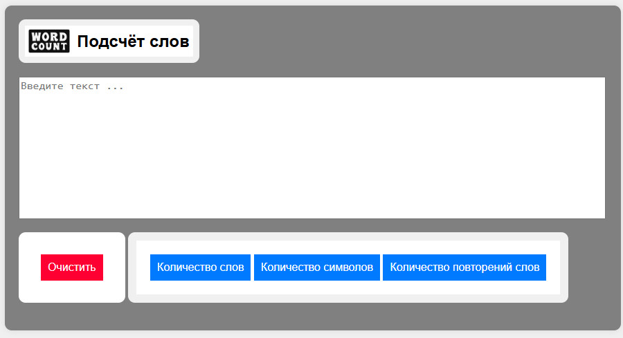

Для просмотра истории всех коммитов выполнить команду:
```
git log
```

Эта команда выведет список всех коммитов с указанием хэша коммита, автора, даты и сообщения.

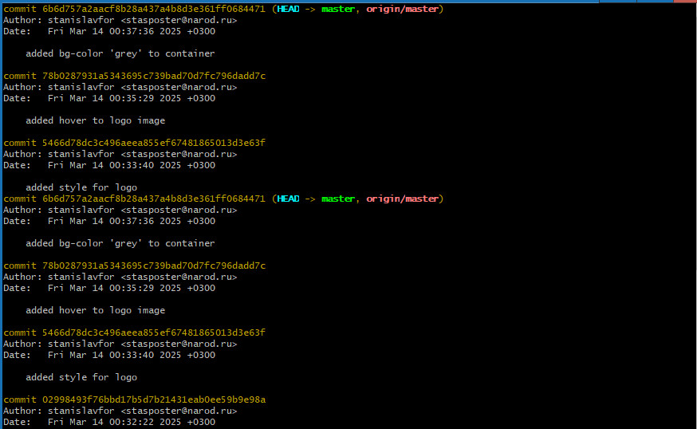

Чтобы выбрать три случайных коммита, необходимо просмотреть вывод команды `git log` и запомнить хэш-команды коммитов, которые интересуют.
```
commit 6b6d757a2aacf8b28a437a4b8d3e361ff0684471 added bg-color 'grey' to container
commit 78b0287931a5343695c739bad70d7fc796dadd7c added hover to logo image
commit 02998493f76bbd17b5d7b21431eab0ee59b9e98a added logo image

```
Посмотреть изменения, сделанные в каждом из выбранных коммитов, используя команду:
```
git show <хэш-коммита>
```
Пример:
```
git show 6b6d757a2aacf8b28a437a4b8d3e361ff0684471
git show 78b0287931a5343695c739bad70d7fc796dadd7c
git show 02998493f76bbd17b5d7b21431eab0ee59b9e98a

```
Это покажет детальную информацию о коммите, включая внесённые изменения.

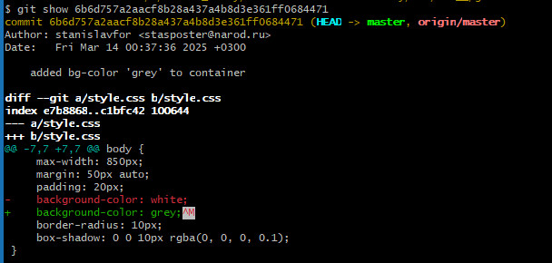
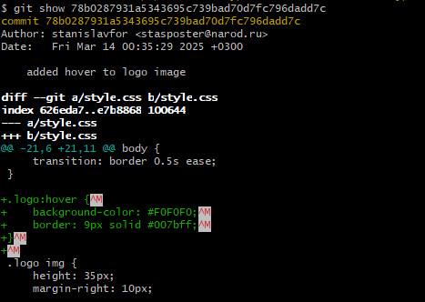
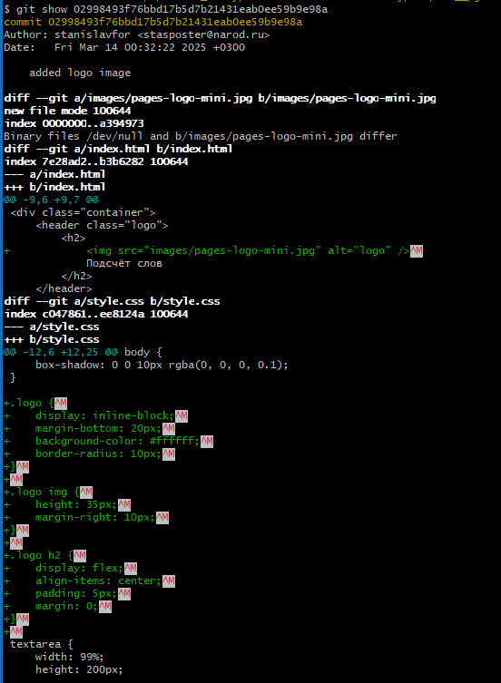

<br><br>

### Задание 2: Отмена изменений с помощью `git revert`

Команда `git revert` создаёт новый коммит, который отменяет изменения предыдущего коммита, сохраняя историю проекта.

Выбрать один из трёх ранее выбранных коммитов и выполнить команду:
```
git revert <хэш-коммита>
```
Например:
```
git revert 6b6d757a2aacf8b28a437a4b8d3e361ff0684471
git revert 78b0287931a5343695c739bad70d7fc796dadd7c
git revert 02998493f76bbd17b5d7b21431eab0ee59b9e98a

```
Git предложит отредактировать сообщение коммита. 

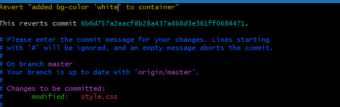

Требуется сохранить изменения и закрыть редактор.

Следует повторить эту операцию для остальных двух коммитов.

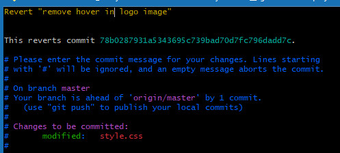

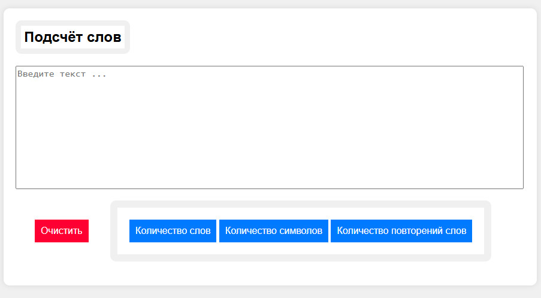

<br><br>

### Задание 3: Отменяем три последних коммита разными способами

#### 3.1. Откат последнего коммита с использованием `git reset --soft` и `git restore`

Команда `git reset --soft` перемещает указатель HEAD на указанный коммит, оставляя изменения в рабочей директории и индексе.

Сначала выполнить команду:
```
git reset --soft HEAD~1
```
Затем восстановить состояние файла до состояния перед последним коммитом:
```
git restore .
```
Теперь можно проверить статус файлов:
```
git status
```
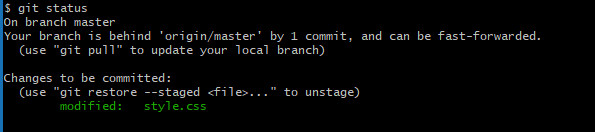

Все изменения находzтся в рабочем каталоге, но не проиндексированы.

#### 3.2. Откат предпоследнего коммита с использованием `git reset --mixed` и `git restore`

Команда `git reset --mixed` также перемещает указатель HEAD на указанный коммит, но сбрасывает индексированные файлы.

Выполнить следующие команды:
```
git reset --mixed HEAD~1
git restore .
```
После этой операции проверить статус файлов:
```
git status
```
Файлы будут сохранены в рабочем каталоге, но не проиндексированы.

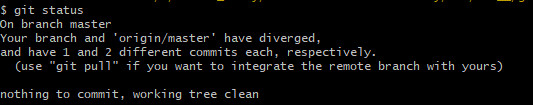

#### Откат первого коммита из трёх выбранных с использованием `git reset --hard`

Команда `git reset --hard` удаляет все изменения после указанного коммита, включая рабочую директорию и индекс.

Для одного выбранного коммита выполнить команду:
```
git reset --hard HEAD~1
```
Этот шаг удалит все изменения после выбранного коммита без возможности восстановления.


### Внимание      

Внимание: `git reset --hard` является потенциально опасным действием, так как уничтожает любые несохранённые изменения.
В данном случае, есть измененные стили на странице, после действий с выбранными коммитами:

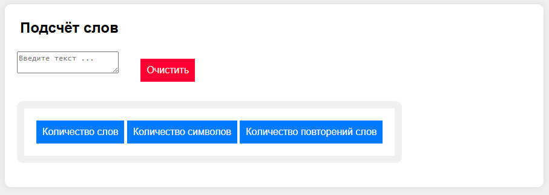

Выполним команду git pull, чтобы оставить нужные изменения:

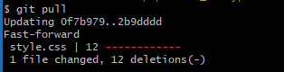

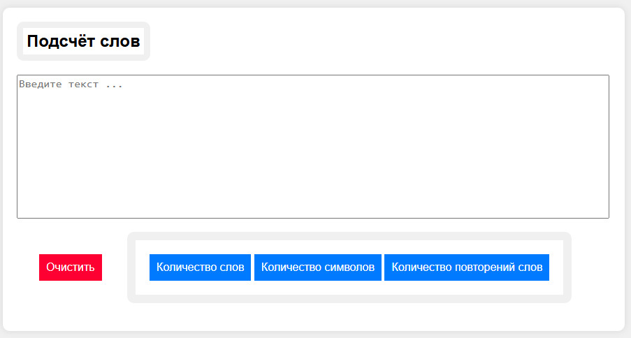

<br><br><hr><hr>

## Инструкция

<br><hr>

### Редактирование сообщений коммита

Когда Git предлагает отредактировать сообщение коммита, открывается встроенный текстовый редактор, по умолчанию это может быть vim, nano или другой установленный редактор.

#### Редактор Vim

- Переход в режим редактирования: нажать клавишу i, чтобы войти в режим вставки текста.
- Редактирование сообщения: изменить текст сообщения, введя нужное содержание.
- Сохранение и выход: нажать Esc, чтобы выйти из режима вставки.
- Далее ввести :wq и нажать Enter, это означает "сохранить и выйти" (write и quit).

#### Редактор Nano

Если используется nano, то откроется простой интерфейс с подсказкой внизу экрана.
- Редактирование сообщения: просто ввести текст, как в обычном текстовом редакторе.
- Сохранение и выход: нажать Ctrl + O (буква "O"), чтобы сохранить изменения.
- Затем нажать Enter, чтобы подтвердить сохранение.
- Наконец, нажать Ctrl + X, чтобы выйти из редактора.

<br><hr>

### Конфликты слияния (`merge conflict`) при попытке сделать `revert` коммита. 

Это происходит, когда изменения в файле, которые нужно отменить, противоречат изменениям, сделанным позже в том же файле.

Чтобы разрешить этот конфликт, можно выполнить следующее:

#### Шаг 1: Разрешение конфликта вручную

Конфликт произошёл в файле `style.css`. 

Открыть файл в текстовом редакторе и найти места конфликтов, что выглядит примерно так:

```
<<<<<<< HEAD
// Код до внесения изменений
=======
// Код из отменяемого коммита
>>>>>>> 02998493f76bbd17b5d7b21431eab0ee59b9e98a

```

Теперь нужно выбрать, какой код оставить, а какой удалить. 

Удалить маркеры `<<<<<<<`, `=======` и `>>>>>>>`, оставляя только нужный код.

Пример:

```
// Оставляем только этот код
```

#### Шаг 2: Пометь файл как разрешённый

После разрешения конфликта пометить файл как успешно обработанный командой `git add`:

```bash
git add style.css
```

### Шаг 3: Продолжаем процесс отмены

Теперь продолжить процесс отмены коммита:

```bash
git revert --continue
```

Если всё прошло успешно, то будет сообщение о создании нового коммита, отменяющего изменения.

### Альтернативные варианты

#### Пропуск коммита
Если не требуется разрешать конфликты сейчас, можно пропустить этот коммит:

```bash
git revert --skip
```

#### Отмена процесса отмены

Если вообще отказаться от попытки отмены коммита, использовать:

```bash
git revert --abort
```

Этот метод возвращает репозиторий в состояние до начала операции `revert`.


<br><hr>
[README](../README.md)


<br> <br> 