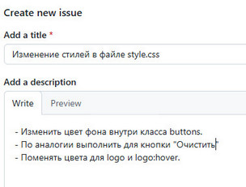

# Контроль версий углублённо (GIT)
## Урок 3. Практики и инструменты для работы с Git
## Домашнее задание

```
Данное домашнее задание является продолжением домашнего задания, 
которое вы выполняли на предыдущем семинаре в репозитории с собственным проектом.
```

#### В этом задании предлагаем каждому из вас побыть в роли тимлида.

1. Пригласите в свой проект кого-то из коллег по обучению, <br> дайте им доступ к своему репозиторию (кроме ветки master).

2. Поставьте ему в GitHub задачу по своему проекту, попросите её выполнить в отдельной ветке, <br> 
   а после выполнения — создать pull request и перевести задачу обратно на вас.

3. Проверьте выполнение задачи, примите pull request и удалите ветку, в которой решалась данная задача.

<br><br>

## Решение домашнего задания
### Задание 1: Добавление коллеги в свой проект

1.1. **Добавление пользователя в репозиторий**:
- Перейти на страницу своего репозитория на GitHub.
- Нажать на вкладку **Settings** (Настройки), затем перейти в раздел **Collaborators** (Соавторы).
- Найти окно **Manage access** (Управление доступом), ввести имя пользователя или адрес электронной почты своего коллеги и нажать **Add collaborator** (Добавить соавтора).


1.2. **Получение пользователем приглашения доступа в репозиторий**:
- Другой пользователь должен в своем аккаунте получить приглашение в соавторство, выполнить требуемые настройки.


<hr>


<hr>


2. **Ограничение прав доступа**:
    - Чтобы ограничить права доступа для основной ветки (`master`), перейти в раздел **Branches** (Ветки) в настройках репозитория, в боковом меню.
    - Найти секцию Branch protection rules (Правила защиты веток), нажать на кнопку Add branch ruleset (Добавить правило).
    - В поле Branch name pattern необходимо ввести название ветки `master`, или найти ветку `master`, нажать **Edit** (Редактировать) рядом с ней.
    - Добавить необходимые правила и ограничения, установив флажки:
      - Включить защиту ветки, выбрав опцию **Require pull request reviews before merging** (Требовать проверку запросов на слияние перед объединением). Это позволит предотвратить прямое внесение изменений в ветку `master`.
      - **Rules applied to everyone including administrators** (Применять правила к администраторам). <br><br>
      
         <br><br>
      
    - Сохранить изменения, нажав Create (Создать). Соавтор сможет просматривать и вносить изменения в другие ветки, но не будет иметь возможности напрямую коммитить изменения в ветку master. Все изменения будут проходить через запросы на слияние (pull requests), которые потребуется одобрить перед слиянием.<br><br>

       <br><br> 

<br><br>

### Задание 2: Создание задачи и pull request

Есть web-приложение для которого можно исправить, доработать стили.


В новой ветке по заданию доработать стили в файле style.css, например:
```
Изменение стилей в файле style.css:

- Изменить цвет фона внутри класса buttons. 
- По аналогии выполнить для кнопки "Очистить"
- Поменять цвета для logo и logo:hover.

```

1. **Создание задачи**:
    - Открыть репозиторий на GitHub и перейти в раздел **Issues** (Задачи).
    - Нажать **New issue** (Новая задача) и заполнить форму с описанием задачи.
    - Назначить задачу вашему коллеге, добавив его имя в поле **Assignees** (Назначенные).
    - Опубликовать задачу.

 <br><br>
 <br><br>

Для коллеги, кому выдано право соавторства, получает требуемый репозиторий в свой аккаунт на GitHub.

2. **Создание новой ветки и выполнение задачи**:
    - Коллега должен выполнить следующие шаги, например:
      ```bash
      # Клонируется репозиторий
      git clone https://github.com/<ваше_имя>/<название_проекта>.git
      
      # Создается новая ветка
      git checkout -b feature/task-name
      # или
      git checkout -b dev-post
      
      # Выполняются необходимые изменения
      # Например, добавляем файл
      touch new_file.txt
      git add new_file.txt
      git commit -m "Added new file for task"
      
      # По текущему заданию требуется изменить стили в файле style.css
      git add .
      git commit -m "fixed style.css for task"
      
      # Отправляем изменения в удаленный репозиторий
      git push origin feature/task-name
      # или
      git push origin dev-post
      
      ```

3. **Создание pull request**:
    - После отправки коллегой изменений, ему нужно перейти на веб-интерфейс GitHub в собственном аккаунте и создать pull request, нажав на кнопку **Compare & pull request** (Сравнить и создать запрос на включение).
    - Описать изменения и назначить в ответ рецензента.<br><br>
   
      
<br><br>

### Задание 3: Проверка и принятие pull request

1. **Проверка pull request**:
    - Перейти в раздел **Pull Requests** (Запросы на включение) собственного репозитория.
    - Выберать созданный pull request и просмотреть изменения.
    - Если всё в порядке, оставить комментарий и подтвердить review.


2. **Принятие pull request**:
    - Нажмите кнопку **Merge pull request** (Объединить запрос на включение).
    - Подтвердите слияние.


3. **Удаление ветки**:
    - После успешного слияния можно увидите предложение удалить ветку. Нажать **Delete branch** (Удалить ветку).
    - Либо удалить ветку вручную через терминал:
      ```bash
      git push origin --delete feature/task-name
      # или
      git push origin --delete dev-post
      
      ```
Выполнив команду 'git pull' в локальной папке, можно проверить наличие принятых изменений для стилей web-приложения:


<br><hr>
[README](../README.md)


<br> <br> 